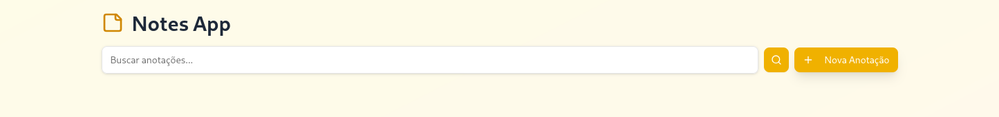

# 📌 Desafio Corporate Web

 <!-- Substitua pelo caminho da sua imagem -->

---

## 🏷️ Badges

  
  
  
  
  
  
  

---

## 📑 Índice

- [📖 Descrição do Projeto](#-descrição-do-projeto)  
- [🚧 Status do Projeto](#-status-do-projeto)  
- [✨ Funcionalidades](#-funcionalidades)  
- [🖥️ Demonstração](#️-demonstração)  
- [📂 Acesso ao Projeto](#-acesso-ao-projeto)  
- [⚙️ Tecnologias Utilizadas](#️-tecnologias-utilizadas)   
- [👨‍💻 Desenvolvedores](#-desenvolvedores)  

---

## 📖 Descrição do Projeto

Este projeto é uma aplicação **full-stack** desenvolvida com **NestJS (backend)**, **ReactJS + TailwindCSS (frontend)** e **PostgreSQL (banco de dados)**, rodando via **Docker** em linux e windows(**WSL**) e via **Makefile** em windows (**WSL**).  

O sistema tem como objetivo representar uma aplição de anotações com funcionalidades de criação, edição, leitura e remoção.

---

## 🚧 Status do Projeto

> 🔨 Projeto concluído  

---

## ✨ Funcionalidades

- ✔️ CRUD de anotações  
- ✔️ Integração com banco PostgreSQL  
- ✔️ Interface responsiva com TailwindCSS  

---

## 🖥️ Demonstração

  

---

## 📂 Acesso ao Projeto

### ✅ Pré-requisitos

### Linux
- [Docker](https://www.docker.com/)  
- [Docker Compose](https://docs.docker.com/compose/)

### Windows
- [PostgreSQL](https://www.postgresql.org/download/windows/)
- [NodeJS](https://nodejs.org/en/download) **(Versão 20.19.5 LTS)**
- [Make](https://sourceforge.net/projects/gnuwin32/files/make/3.81/make-3.81.exe/download?use_mirror=sinalbr&download)

### ▶️ Rodando com Docker

- git clone https://github.com/pedro-lucas-martins/desafio-corporate-web
- cd seu-repo
- docker-compose up --build

#### Para parar a aplicação use:
- docker compose down --rmi all -v

🔗 Endpoints:
- **Frontend (React):** http://localhost:3000  
- **Backend (NestJS):** http://localhost:3001  
- **Banco (PostgreSQL):** localhost:5432  

### ▶️ Rodando com Makefile

- git clone em https://github.com/pedro-lucas-martins/desafio-corporate-web
- cd seu-repo
-  make build: instalação de pacotes 
-  make start: Subir ambiente 
-  make stop: Para a aplicação 
-  make clean: Remove pasta node_modules 

---

## ⚙️ Tecnologias Utilizadas

- **Frontend:** ReactJS + TailwindCSS  
- **Backend:** NestJS  
- **Banco de Dados:** PostgreSQL  
- **Infraestrutura:** Docker, Docker Compose  
- **Outros:** Makefile, TypeScript, REST API  

---

## 👨‍💻 Desenvolvedores

Este projeto foi desenvolvido por:  

- **Pedro Martins** – [@pedro-lucas-martins](https://github.com/pedro-lucas-martins)  

---

## 📜 Licença

Este projeto está licenciado sob a licença **MIT** - veja o arquivo [LICENSE](LICENSE) para mais detalhes.  
