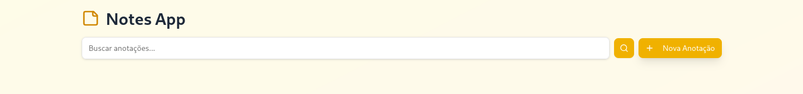
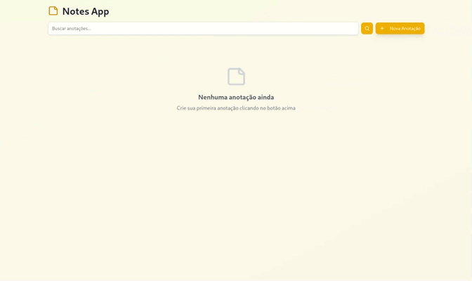
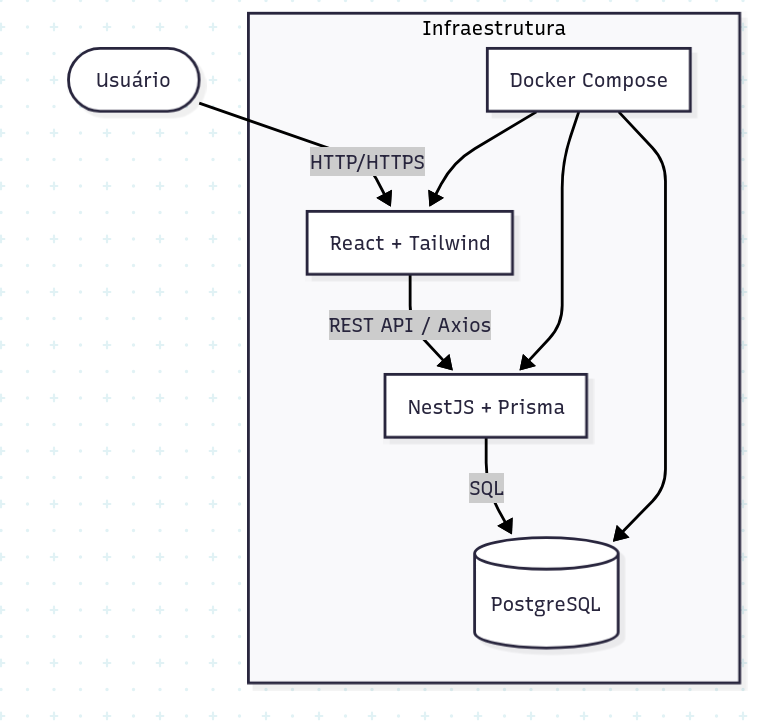

# 📌 Desafio Corporate Web



---

## 🏷️ Badges

  
  
  
  
  


---

## 📑 Índice

- [📖 Descrição do Projeto](#-descrição-do-projeto)
- [🚧 Status do Projeto](#-status-do-projeto)
- [✨ Funcionalidades](#-funcionalidades)
- [🖥️ Demonstração](#️-demonstração)
- [📂 Instalação e uso](#-instalação-e-uso)
- [⚙️ Tecnologias Utilizadas](#-tecnologias-utilizadas)
- [📂 Estrutura do Projeto](#-estrutura-do-projeto)
- [🏗️ Arquitetura do Sistema](#-arquitetura-do-sistema)
- [👨‍💻 Desenvolvedores](#-desenvolvedores)

---

## 📖 Descrição do Projeto

Este projeto é uma aplicação **full-stack** desenvolvida com **NestJS (backend)**, **ReactJS + TailwindCSS (frontend)** e **PostgreSQL (banco de dados)**, rodando via **Docker** em linux e windows(**WSL**) e via **Makefile** em windows (**WSL**).

O sistema tem como objetivo representar uma aplição de anotações com funcionalidades de criação, edição, leitura e remoção.

---

## 🚧 Status do Projeto

> 🔨 Projeto concluído

---

## ✨ Funcionalidades

- ✔️ CRUD de anotações
- ✔️ Integração com banco PostgreSQL
- ✔️ Interface responsiva com TailwindCSS

---

## 🖥️ Demonstração



---

## 📂 Instalação e uso

### ✅ Pré-requisitos

### Linux

- [Docker](https://www.docker.com/)
- [Docker Compose](https://docs.docker.com/compose/)

### Windows

- [PostgreSQL](https://www.postgresql.org/download/windows/)
- [NodeJS](https://nodejs.org/en/download) **(Versão 20.19.5 LTS)**
- [Make](https://sourceforge.net/projects/gnuwin32/files/make/3.81/make-3.81.exe/download?use_mirror=sinalbr&download)

### ▶️ Rodando com Docker

1. Clone o repositório

```bash
git clone https://github.com/pedro-lucas-martins/desafio-corporate-web.git
```

2. Navegue atá o diretório do projeto

```bash
cd seu-repo
```

3. Crie uma cópia do arquivo exemplo .env.example e renomei-a para .env

- Linux:

```bash
# Para o frontend
cp desafio-corporate-web-frontend/env.example .env
# Para o backend
cp desafio-corporate-web-backend .env.example .env
```

- Windows

```powershell
# Para o frontend
copy desafio-corporate-web-frontend/env.example .env
# Para o backend
copy desafio-corporate-web-backend .env.example .env
```

4. Rode o container

```bash
docker-compose up --build
```

5. Acesse o site em seu navegador

```bash
http://localhost:3001
```

#### Para parar a aplicação use:

```bash
docker compose down --rmi all -v
```

🔗 Endpoints:

- **Frontend (React):** http://localhost:3000
- **Backend (NestJS):** http://localhost:3001
- **Banco (PostgreSQL):** localhost:5432

### ▶️ Rodando com Makefile

#### **ATENÇÃO**

É necessário instalar o NodeJS, o PostgreSQL e o make manualmente para rodar sem o uso de containers no windows

1. Clone o repoitório

```bash
git clone em https://github.com/pedro-lucas-martins/desafio-corporate-web.git
```

2. Navegue atá o diretório do projeto

```bash
cd seu-repo
```

3. Crie uma cópia do arquivi de exemplo .env.example e renomei-a para .env

```powershell
# Para o frontend
copy desafio-corporate-web-frontend/env.example .env
# Para o backend
copy desafio-corporate-web-backend .env.example .env
```

4. Faça o build do projeto

```bash
make build
```

5. Rode o projeto

```bash
make start
```

6. Acesse o site em seu navegador

```bash
http://localhost:3001
```

### Para parar a aplicação

```bash
make stop
```

Remover os arquivos criados

```
make clean: Remove pasta node_modules
```

---

## ⚙️ Tecnologias Utilizadas

- **Frontend:** ReactJS + TailwindCSS
- **Backend:** NestJS
- **Banco de Dados:** PostgreSQL
- **Infraestrutura:** Docker, Docker Compose
- **Outros:** Makefile, TypeScript, REST API

---

## 📂 Estrutura do Projeto

```bash
desafio-corporate-web/
├── desafio-corporate-web-backend/   # Backend NestJS
│   ├── config/                      # Arquivos de configuração do projeto
│   ├── coverage/                    # Relatórios de cobertura de testes
│   ├── decorator/                   # Decorators personalizados do NestJS
│   ├── dist/                        # Código transpilado (build)
│   ├── node_modules/                # Dependências do Node.js
│   ├── prisma/                      # Definição de schema e migrations do Prisma ORM
│   ├── src/                         # Código-fonte principal (módulos, controllers, services)
│   ├── test/                        # Testes automatizados (unitários e e2e)
│   ├── Dockerfile                   # Dockerfile para container do backend
│   ├── package.json                 # Dependências e scripts do backend
│   ├── package-lock.json            # Lockfile do npm
│   ├── tsconfig.json                # Configuração do TypeScript
│   └── ...
│
├── desafio-corporate-web-frontend/  # Frontend React + Tailwind
│   ├── dist/                        # Build final do frontend (gerado pelo Vite)
│   ├── node_modules/                # Dependências do Node.js
│   ├── public/                      # Arquivos estáticos (favicon, imagens, etc.)
│   ├── src/                         # Código-fonte principal (componentes, páginas, estilos)
│   ├── nginx.conf                   # Configuração do Nginx para servir a aplicação
│   ├── Dockerfile                   # Dockerfile para container do frontend
│   ├── index.html                   # Página HTML inicial do Vite
│   ├── package.json                 # Dependências e scripts do frontend
│   ├── vite.config.js               # Configuração do bundler Vite
│   └── ...
│
├── docs/                            # Documentação e recursos visuais
│   ├── cover.png                    # Imagem de capa usada no README
│   └── demo/                        # Prints e gifs de demonstração da aplicação
│
├── docker-compose.yml               # Orquestração dos containers (backend, frontend, db)
├── Makefile                         # Atalhos para automação de comandos (up, down, build, etc.)
└── README.md                        # Documentação principal do projeto
```

---

## 🏗️ Arquitetura do Sistema

A aplicação é organizada em uma arquitetura de **três camadas**, containerizada via **Docker Compose**:



## 👨‍💻 Desenvolvedores

Este projeto foi desenvolvido por:

- **Pedro Martins** – [@pedro-lucas-martins](https://github.com/pedro-lucas-martins)
